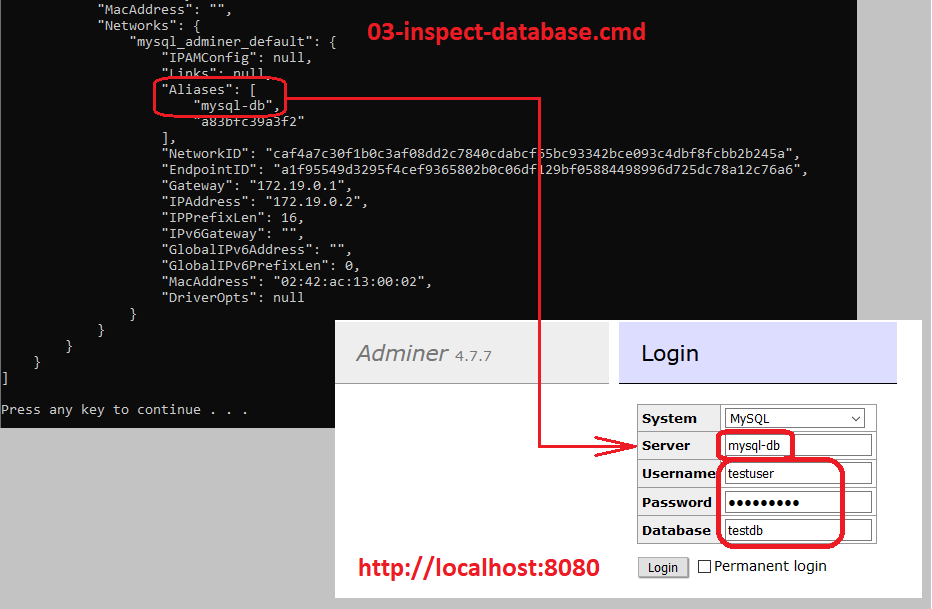

# MySQL connection source codes
Small example console source codes how to connect to the MySQL, how to update rows and how to read the table.

## Running under Windows
1. clone this repository to your computer
2. install the **MySQL** (as a **Docker** container)
3. prepare the user, the table and rows in the database
4. build and run the example **Java** code
5. compile and run the example **.NET C#** code
6. run the example **PHP** code

### 1. Cloning to your computer
- install [GIT] on your computer
- clone this repository to your computer by the GIT command
  `git clone https://github.com/petrfaltus/mysql-connection-source-codes.git`

### 2. Installation of the Oracle database (as a Docker container)
- install [docker desktop] on your computer
- refer the [MySQL image]
- refer the [Adminer image]

The subdirectory `docker-database` contains prepared Windows batches:
- `01-run-database.cmd` - pulls images and runs both containers (database + adminer) after the compose file **at the first time**
- `02-switch-database-OFF.cmd` - stops both already existing containers (adminer + database)
- `02-switch-database-ON.cmd` - starts both already existing containers (database + adminer)
- `03-inspect-database.cmd` - shows details for already existing database container
- `03-inspect-adminer.cmd` - shows details for already existing adminer container
- `04-exec-connection-to-database-root.cmd` - executes the **mysql cli** terminal into running database container (as the user *root*)
- `04-exec-connection-to-database-testuser.cmd` - executes the **mysql cli** terminal into running database container (as the user *testuser*)
- `containers.cmd` - lists currently running containers and list of all existing containers

### 3. Preparing the database
For the connection to the database use either the **mysql cli** terminal or the Adminer container on [http://localhost:8080](http://localhost:8080)

#### Connection using Adminer container
User *root* (default password *R00tPa33w0rd!*)


User *testuser* (default password *T3stUs3r!*)



#### SQL lines for root
```sql
SET NAMES utf8;

CREATE USER `testuser` IDENTIFIED BY 'T3stUs3r!';
CREATE DATABASE `testdb`;
GRANT ALL PRIVILEGES ON `testdb`.* TO `testuser`@`%`;
```

#### SQL lines for testuser
```sql
SET NAMES utf8;

USE `testdb`;

DROP TABLE IF EXISTS `people`;
CREATE TABLE `people` (
  `name` VARCHAR(40) NOT NULL,
  `surname` VARCHAR(60) NOT NULL,
  `age` TINYINT UNSIGNED NOT NULL,
  `created` DATETIME DEFAULT CURRENT_TIMESTAMP,
  `updated` DATETIME ON UPDATE CURRENT_TIMESTAMP,
  `remark` VARCHAR(80),
  `id` SMALLINT UNSIGNED NOT NULL AUTO_INCREMENT,
  PRIMARY KEY (`id`)
);

INSERT INTO `people` (`name`, `surname`, `age`) VALUES ('Robin', 'Shark', 35);
INSERT INTO `people` (`name`, `surname`, `age`) VALUES ('Linda', 'Morwin', 28);
INSERT INTO `people` (`name`, `surname`, `age`) VALUES ('Patrick', 'Woody', 51);
INSERT INTO `people` (`name`, `surname`, `age`) VALUES ('Aneta', 'White', 17);
INSERT INTO `people` (`name`, `surname`, `age`) VALUES ('Roger', 'Hover', 29);
```

## Versions
Now in August 2020 I have the computer with **Windows 10 Pro 64bit**, **12GB RAM** and available **50GB free HDD space**

| Tool | Version | Setting |
| ------ | ------ | ------ |
| [GIT] | 2.26.0.windows.1 | |
| [docker desktop] | 2.3.0.4 (46911) stable | 2 CPUs, 3GB memory, 1GB swap, 48GB disc image size |
| [MySQL image] | 5.7.30 | default password for root: R00tPa33w0rd! |
| [Adminer image] | 4.7.7-standalone | |

## To do (my plans to the future)


[GIT]: <https://git-scm.com>
[docker desktop]: <https://docs.docker.com/desktop/>
[MySQL image]: <https://hub.docker.com/_/mysql>
[Adminer image]: <https://hub.docker.com/_/adminer>
